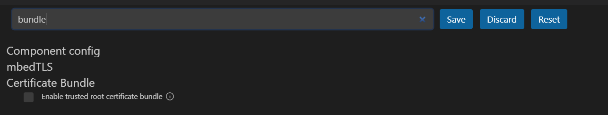

# JTAG Flashing

In this document the ESP32-C3-DevkitM-1 and the ESP-PROG programmer are used. Vscode is running on Windows 11.

## Connection
Connect the ESP-PROG and ESP32-C3-Mini-1 pins as show in the table below. The table lists the pin name and the pin number in brackets.

|ESP32-C3-Mini-1 (PIN)| ESP-PROG (PIN)  |
|:-------------------:|:----------:|
|VCC (2)              |VCC (1)     |
|GPIO4 (11)           |ESP_TMS (2) | 
|GPIO6 (9)            |ESP_CLK (4) |
|GPIO7 (8)            |ESP_TDO (6) |
|GPIO5 (10)           |ESP_TDI (8) |
|GND (1)              |GND (9)     |


## Project setup

Hit CTRL+SHIFT+P to open the control palette. Write ```show example project``` and click on the ```use current ESP-IDF``` dropdown item. Select "hello world". On the control palette write "set target" and select ESP32-C3 ESP-PROG on the dropdown menu. 
Before compiling the project, write "menuconfig" on the control palette and look for "bundle". Deselect 



On the control palette write build and select the ESP-IDF: Build your project. When finished, on the control palette search for ```select port to use``` and choose the right port. On Windows port names start with "COM", while in Linux they're called "tty" and usually "ttyUSB".

Write ```flash (JTAG)``` on the control palette and hit Enter. If you get ```Error: libusb_open() failed with LIBUSB_ERROR_NOT_FOUND``` follow the procedure [here](https://community.platformio.org/t/esp32-pio-unified-debugger/4541/20) to replace the drivers.
