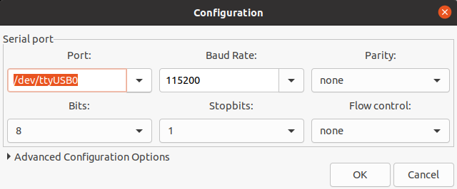

# Getting started

In this tutorial we will gain access to a shell on the Linux system in the IDO-SBC2D70. The IDO-SBC2D70 runs [openwrt](https://openwrt.org/) and there are three ways to connect to a shell on board:
1. Serial connection (UART): connecting a USB/UART bridge (like [this one](https://www.amazon.com/IZOKEE-CP2102-Converter-Adapter-Downloader/dp/B07D6LLX19/ref=sr_1_4?dchild=1&keywords=usb+uart&qid=1617289049&sr=8-4))
2. Telnet
3. SSH

The following has been done on an Ubuntu 20.04 machine.

## Serial Connection

The simples way to gain access to a console is to connect a USB/UART bridge on the DEBUG connector. The DEBUG connector is a PH2.0, so if you're using the USB/UART mentioned above, you need an adapter like [this one](https://www.amazon.it/gp/product/B08QYV36T7/ref=ppx_yo_dt_b_asin_title_o03_s00?ie=UTF8&psc=1).

### Connection
The DEBUG port has the following layout:

|Pin Nr.| Function |
|:-----:|:--------:|
|1      |TX        |
|2      |RX        |
|3      |GND       |
|4      |NC        |

TX and RX are at 3.3V. Connect the ground, the TX of the USB/UART Bridge with the RX (i.e. Pin 2 on the board) and RX of the Bridge with the TX on the board (i.e. Pin 3).

### Serial connection software

We will use GTK-Term. To install it open a terminal and write
`sudo apt-get install gtkterm`
Open it, click on configuration and set the value as below

Check the port, which is usually called /dev/ttyUSB0 or /dev/ttyUSB1 on Ubuntu.