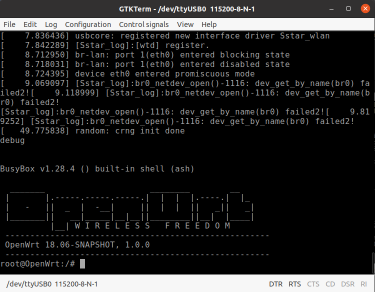

# Getting started

In this tutorial we will gain access to a shell on the Linux system in the IDO-SBC2D70. The IDO-SBC2D70 runs [openwrt](https://openwrt.org/) and there are three ways to connect to a shell on board:
1. Serial connection (UART): connecting a USB/UART bridge (like [this one](https://www.amazon.com/IZOKEE-CP2102-Converter-Adapter-Downloader/dp/B07D6LLX19/ref=sr_1_4?dchild=1&keywords=usb+uart&qid=1617289049&sr=8-4))
2. Telnet
3. SSH

The following has been done on an Ubuntu 20.04 machine.

## Serial Connection

The simples way to gain access to a console is to connect a USB/UART bridge on the DEBUG connector. The DEBUG connector is a PH2.0, so if you're using the USB/UART mentioned above, you need an adapter like [this one](https://www.amazon.it/gp/product/B08QYV36T7/ref=ppx_yo_dt_b_asin_title_o03_s00?ie=UTF8&psc=1).

### Connection
The DEBUG port has the following layout:

|Pin Nr.| Function |
|:-----:|:--------:|
|1      |TX        |
|2      |RX        |
|3      |GND       |
|4      |NC        |

TX and RX are at 3.3V. Connect the ground, the TX of the USB/UART Bridge with the RX (i.e. Pin 2 on the board) and RX of the Bridge with the TX on the board (i.e. Pin 3).

### Serial connection software

We will use GTK-Term. To install it open a terminal and write
`sudo apt-get install gtkterm`
Open it, click on configuration and set the value as below

Check the port, which is usually called /dev/ttyUSB0 or /dev/ttyUSB1 on Ubuntu. 
Now connect an usb-c charger (e.g. of a smartphone) and wait the boot. Note that using a laptop usb-c charger could not work, so a smartphone one is reccomended. 
When the system has completely booted up, hit enter and you'll see the shell:

## Telnet

On the system is running both a telnet and an ssh deamon. To connect to the system, power on the board with an usb-c charger and connect the Ethernet cable.
The board will try to connect with IP `192.168.1.1`, so before connecting it, check weather your router is using the same address. To do so, you can open a terminal, write `ifconfig`, and looking for ip address specified after "broadcast", e.g. `ifconfig | grep broadcast | awk '{ print $6 }'`. Otherwise you can follow this [tutorial](https://www.howtogeek.com/233952/how-to-find-your-routers-ip-address-on-any-computer-smartphone-or-tablet/).

In this example the router is connected to the address `192.168.1.254`. 

### Connection
On almost any Linux distro a telnet client is already availble. Open the terminal and write
`telnet 192.168.1.1`
You will get the same screen as in the previous image.

## SSH

To connect via SSH you can follow exactly the same steps shown in the previous section, but instead of calling the telnet client, you write
`ssh root@192.168.1.1`

Note that open wrt comes with a blank default root password. This is a problem for the next steps, where we'll be using `scp`. So once connected we set the root password by writing
`passwd ` and choosing a password.
